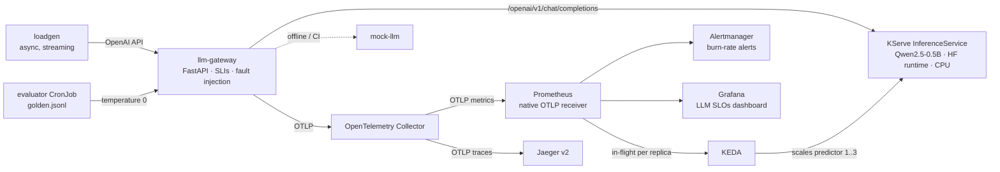

# llm-slo-lab

**SLOs for LLM inference on Kubernetes**: time to first token, tokens per second, cost per
request and an evaluation-based quality signal, measured with OpenTelemetry GenAI semantic
conventions, stored in Prometheus, alerted on with multi-window multi-burn-rate rules, and
scaled with KEDA. Companion lab for the KubeCon + CloudNativeCon Europe 2027 lightning talk
**"SLOs for LLMs: What an SRE Measures When the Output Is Probabilistic"**.

> **This is a personal lab.** It is not production software, it is not a system of my
> employer, and it contains no employer data, prices or practices. All costs, thresholds and
> objectives are illustrative assumptions chosen for a demo on a laptop.

Português (Brasil): [docs/pt-br/README.md](docs/pt-br/README.md)

## Status

| Phase | Scope | Status |
|---|---|---|
| 0 | Toolchain, repo, skeleton, research ADRs | done |
| 1 | kind cluster, cert-manager, KServe Standard mode, Qwen2.5-0.5B on CPU | done |
| 2 | mock-llm and llm-gateway (OTel GenAI metrics, traces, cost, fault injection) | done |
| 3 | kube-prometheus-stack, OpenTelemetry Collector, Jaeger | done |
| 4 | SLIs, SLOs, recording rules, burn-rate alerts, promtool tests | done |
| 5 | Quality signal: golden dataset and evaluator CronJob | done |
| 6 | KEDA autoscaling on in-flight requests | pending |
| 7 | Chaos toggles | pending |
| 8 | Grafana "LLM SLOs" dashboard | pending |
| 9 | CI, docs, PT-BR, lightning script, recordings | pending |

## Quickstart

_Filled in when the phases above are done. Target: three commands._ Today:

```bash
scripts/install-tools.sh   # kind, kubectl, helm, promtool, kubeconform, jq, make, uv — no sudo
make cluster platform      # kind + cert-manager + KServe (Standard mode)
make kind-load-hf          # pull the 4 GB runtime image once and load it into kind
make model-cache model     # download Qwen2.5-0.5B-Instruct into a PVC, deploy the InferenceService
make smoke-model           # stream a chat completion straight from KServe
make images mock gateway   # build mock-llm + llm-gateway, load into kind, deploy
make smoke                 # stream a chat completion through the gateway (localhost:30080)
make use-mock | use-model  # point the gateway at mock-llm (offline demo / CI) or the model
make loadgen CONCURRENCY=1 DURATION=120   # or RAMP=1:60,4:120,1:60
make verify-telemetry      # PromQL for every SLI signal + one Jaeger trace
make ui                    # Grafana / Prometheus / Alertmanager / Jaeger port-forwards
make test lint             # pytest (gateway, mock-llm), ruff, yamllint, kubeconform
```

Measured on the development laptop (WSL2, 8 CPUs / 12 GB): the model is Ready ~95 s after
`kubectl apply`, TTFT is 0.4–0.5 s and output is ~4.5 tokens/s on CPU. Idle memory after
Phase 1 is ~4.2 GB. The runtime image needs ~14 GB of disk in Docker plus a copy in the kind
node.

## Architecture



`make ui` port-forwards Grafana (3000), Prometheus (9090), Alertmanager (9093) and Jaeger
(16686); the gateway is reachable at `localhost:30080` through the kind NodePort.

## The framework

_The SLI → why → how → which CNCF project table lives in [docs/framework.md](docs/framework.md)._

## What the gateway measures

`llm-gateway` is an OpenAI-compatible proxy in front of the model. For every chat completion
(streaming or not) it records, with OpenTelemetry GenAI semantic conventions (ADR-005):

| Signal | Metric | How |
|---|---|---|
| Time to first token | `gen_ai.server.time_to_first_token` | wall time until the first chunk with content |
| Time per output token | `gen_ai.server.time_per_output_token` | (end − first token) / (output tokens − 1) |
| Output tokens/s | `llm_slo.output_tokens` (unit `{token}/s`) | inverse of the above, per request |
| Duration | `gen_ai.client.operation.duration`, `gen_ai.server.request.duration` | whole request |
| Tokens | `gen_ai.client.token.usage` (`gen_ai.token.type` = input/output) | upstream `usage` if present, else the model tokenizer (`llm_slo.token_source`) |
| Outcome | `llm_slo.requests` (`llm_slo.outcome`) | success, upstream_error, timeout, empty, truncated, injected_error |
| Cost | `llm_slo.request.cost` (`llm_slo.cost_model`) | see below |
| Queue depth | `llm_slo.requests.in_flight` | KEDA's scaling signal |

Histogram buckets are tuned for CPU inference (TTFT 0.1 s … 30 s, time per token 10 ms … 2.5 s)
and are configurable with `GW_BUCKETS_TTFT`, `GW_BUCKETS_TPOT`, `GW_BUCKETS_DURATION`,
`GW_BUCKETS_TOKENS`, `GW_BUCKETS_COST`, `GW_BUCKETS_TOKEN_RATE` (comma-separated seconds /
tokens / USD). See `gateway/app/config.py` and `gateway/k8s/configmaps.yaml`.

Empty and truncated responses are **bad events**: a 200 with nothing useful in it is still a
failure from the user's point of view. Fault injection (`FAULT_ERROR_RATE`,
`FAULT_EXTRA_LATENCY_MS`) and the system prompt come from ConfigMaps so the chaos toggles can
flip them. Requests may carry `x-mock-*` headers, which the gateway forwards to `mock-llm`
(the real model ignores them).

## SLOs and alerts

[slo/slos.yaml](slo/slos.yaml) is the source of truth; `make slo-gen` renders the rules.

| SLI | Good event | Objective (30 d) | Page at |
|---|---|---|---|
| Availability | `llm_slo_outcome="success"` (no error, timeout, empty or truncated response) | 99 % | 1h/5m 14.4×, 6h/30m 6× |
| Responsiveness | TTFT < 2 s on CPU (0.5 s on GPU) | 95 % | 1h/5m 14.4×, 6h/30m 6× |
| Throughput | > 3 output tokens/s on CPU (20 on GPU) | 90 % | 1h/5m 8×, 6h/30m 5× |
| Quality | evaluator checks passing | 90 % | 1h/5m 8×, 6h/30m 5× |
| Cost | amortized cost per 1k requests within budget (1.5 notional USD) | budget, not SLO | ticket only |

Tickets open at 1d/2h 3× and 3d/6h 1×. Why 8×/5× for the 90 % objectives: a burn rate can
never exceed 1/(1 − objective), and 14.4 × 10 % would be 144 % bad events. Recording rules
exist for 5m, 30m, 1h, 2h, 6h, 1d, 3d plus the 30-day error budget (`slo:` prefix).

`slo/rules-demo.yaml` is the same logic with windows compressed to 1m…20m (`slodemo:` prefix,
`…Demo` alert names) so that a toggle pages during a 5-minute talk. It is **demo only**.
`make slo-check` runs `promtool check rules` and the unit tests in `slo/tests/`;
`make slo-status` shows rule health, burn rates and firing alerts.

## Quality signal

[eval/golden.jsonl](eval/golden.jsonl) holds 40 prompts with **deterministic checks**: keywords
present (`contains`), valid JSON matching a schema (`json`), a refusal where one is required
(`refuse`), and a word limit (`max_words`). The evaluator CronJob runs a rotating 12-item slice
every 2 minutes at temperature 0 through the gateway and emits `llm_slo.eval.checks` and
`llm_slo.eval.items` counters (pass/fail) plus a `llm_slo.eval.pass_ratio` gauge over OTLP.
The Quality SLI is the pass ratio of checks. Evaluator requests carry `x-llm-slo-client:
evaluator`, so they are excluded from the user-facing SLIs.

What this is not: a measure of quality. Deterministic checks are a *proxy* that catches
regressions (a broken system prompt, a bad model rollout, a quantization gone wrong), not a
judgement of helpfulness. LLM-as-judge with a stronger model is listed as future work.
Measured with Qwen2.5-0.5B-Instruct: ~93–95 % of checks pass when healthy; the model
consistently **fails the two refusal items** (it complies with harmful requests even when
told not to), which the signal makes visible rather than hides. A few items flip between runs
even at temperature 0 (fp32 on CPU is not bit-exact across runs), which is why the SLI is a
ratio over a window and the page threshold needs 50 % failures.

## Cost assumptions

**All cost figures are assumptions, not real prices.** They live in
`gateway/k8s/configmaps.yaml` and are labelled `llm_slo.cost_model` so you can swap them:

- **amortized**: a node is paid by the hour whether busy or not, so a request's cost is its
  share of node-time: `node_cost_per_hour / 3600 × duration_s / requests_in_flight`.
  Default `node_cost_per_hour = 0.40` (a 4 vCPU / 16 GB on-demand VM, rounded).
- **per_token**: marketplace style, `input_tokens/1000 × 0.00015 + output_tokens/1000 × 0.0006`.

Cost is a budget signal, not an SLO: the rules alert when cost per 1k requests leaves the
budget, but nobody is paged for it.

## Privacy by default

The gateway never records prompt or response content in traces, logs or metrics unless
`CAPTURE_CONTENT=true` is set. Telemetry is copied, retained and searched by people and
systems that were never meant to read a user's prompt; keeping content out of the pipeline
by default is itself an SRE control. See ADR-009 in [docs/decisions.md](docs/decisions.md).

## Limitations

- CPU inference with a 0.5B model is slow (~4.5 tokens/s) and the model is small; the point is
  the measurement, not the answers.
- The KServe Hugging Face backend does not report `usage` in streamed responses, so the
  gateway counts tokens with the tokenizer (ADR-006). The vLLM/GPU profile does report it.
- The GPU profile (`model/gpu/`) is documented but was not run (ADR-010).
- `finish_reason` from the HF backend is not reliable for detecting truncation (ADR-013).
- The quality signal is a deterministic proxy, calibrated to what a 0.5B model can do; it
  catches regressions, it does not grade answers. LLM-as-judge is future work.
- The 0.5B model does not refuse harmful requests reliably; the golden set keeps two refusal
  items so the quality signal reflects that.
- With one CPU replica the model serves one request at a time; evaluator runs and user
  traffic compete, which is what the KEDA phase is for.

## Decisions and versions

Every pinned version is in [versions.env](versions.env); the reasoning, with what was checked
against upstream docs and when, is in [docs/decisions.md](docs/decisions.md).

## License

Apache-2.0. Model weights are not part of this repository; Qwen2.5-0.5B-Instruct is
distributed by Alibaba Cloud under Apache-2.0.
