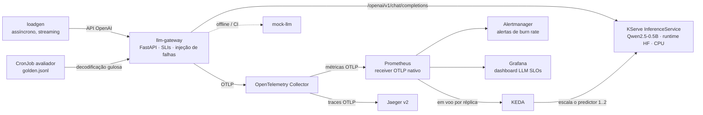
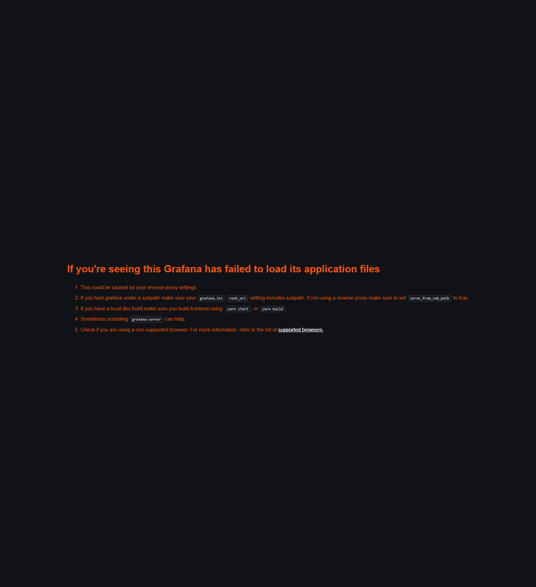

# llm-slo-lab

**SLOs para inferência de LLM em Kubernetes**: tempo até o primeiro token, tokens por segundo,
custo por requisição e um sinal de qualidade baseado em avaliação, medidos com as convenções
semânticas GenAI do OpenTelemetry, armazenados no Prometheus, alertados com regras
multi-janela e multi-burn-rate, e escalados com KEDA. Laboratório que acompanha a lightning
talk da KubeCon + CloudNativeCon Europe 2027 **"SLOs for LLMs: What an SRE Measures When the
Output Is Probabilistic"**.

> **Este é um laboratório pessoal.** Não é software de produção, não é um sistema do meu
> empregador e não contém dados, preços ou práticas do empregador. Todos os custos, limiares e
> objetivos são premissas ilustrativas escolhidas para uma demonstração em um notebook.

English: [README.md](../../README.md) · Framework em português: [framework.md](framework.md)

## Início rápido

```bash
scripts/install-tools.sh   # kind, kubectl, helm, promtool, kubeconform, jq, make, uv — sem sudo
make up                    # cluster, plataforma, modelo, gateway, avaliador, regras, dashboard (~25 min)
make demo                  # UIs em localhost:3000/9090/9093/16686 + 20 min de carga em segundo plano
```

Depois, em outro terminal: `make break-errors`, observe o Grafana, `make heal`. Requisitos
medidos no notebook de desenvolvimento: 8 CPUs e 12 GB para a VM que roda Docker e kind (aqui,
WSL2), ~20 GB de disco (a imagem do runtime do KServe tem 14 GB descompactada, mais uma cópia
dentro do nó kind), sem GPU. Memória ociosa com tudo instalado: ~6 GB; pico durante a rampa de
autoscaling: 8,4 GB.

Os alvos individuais (`make help` lista todos): `cluster platform`, `kind-load-hf`,
`model-cache model`, `smoke-model`, `images mock gateway`, `smoke`, `use-mock | use-model`,
`loadgen`, `verify-telemetry`, `ui`, `eval eval-run`, `slo slo-demo dashboard`,
`break-errors | break-latency | break-throughput | break-quality | heal | chaos-status`,
`test lint slo-check`.

Medido no notebook (WSL2, 8 CPUs / 12 GB): o modelo fica Ready ~95 s após o `kubectl apply`,
o TTFT é de 0,6–0,9 s através do gateway e a saída é de ~4,5–5,5 tokens/s em CPU com uma
requisição em voo.

## Arquitetura



`make ui` faz port-forward do Grafana (3000), Prometheus (9090), Alertmanager (9093) e Jaeger
(16686); o gateway fica acessível em `localhost:30080` pelo NodePort do kind.

## O framework

O slide único da palestra; a versão longa, com o que o laboratório ensinou, está em
[framework.md](framework.md).

| SLI | Por que importa | Como é medido | Projeto CNCF |
|---|---|---|---|
| Disponibilidade (99 %) | um 200 com resposta vazia ou cortada é falha para o usuário | o gateway classifica cada requisição: erro, timeout, vazia e truncada são eventos ruins | OpenTelemetry → Prometheus |
| Responsividade (95 % TTFT < 2 s) | o tempo até o primeiro token é quando o usuário vê que o modelo está vivo; é o sinal de fila | histograma `gen_ai.server.time_to_first_token`, bucket `le="2"` | OpenTelemetry (semconv GenAI) → Prometheus |
| Vazão (90 % > 3 tok/s) | velocidade de leitura; um stream lento parece quebrado | tokens/s após o primeiro token, contados com o tokenizer quando o servidor não envia `usage` | OpenTelemetry → Prometheus, modelo no KServe |
| Qualidade (90 % das verificações passam) | a saída é probabilística; um teste repetível é o sinal honesto | um CronJob roda um conjunto dourado com decodificação gulosa e emite contadores pass/fail | Kubernetes CronJob → OpenTelemetry → Prometheus |
| Custo (orçamento) | tokens e horas de nó são dinheiro | custo amortizado de tempo de nó e por token em cada requisição, premissas em um ConfigMap | OpenTelemetry → Prometheus (ticket, sem page) |
| Alertas | a burn rate diz quão rápido o orçamento acaba | regras multi-janela e multi-burn-rate geradas de uma única especificação, testadas com promtool | Prometheus + Alertmanager |
| Capacidade | um modelo limitado por CPU está a 100 % de CPU sempre que trabalha | escalar por requisições em voo por réplica | KEDA via integração nativa do KServe |

## A palestra

Lightning talk, KubeCon + CloudNativeCon Europe 2027 (Barcelona), trilha AI Inference and
Infrastructure. Roteiro, checklist pré-palestra e planos B:
[talk/lightning-script.md](../../talk/lightning-script.md) (em inglês); gravações de terminal
como fallback no palco: [talk/recordings/](../../talk/recordings/). O link da agenda será
adicionado quando o programa for publicado.

## O que o gateway mede

`llm-gateway` é um proxy compatível com OpenAI na frente do modelo. Para cada chat completion
(com ou sem streaming) ele registra, com as convenções semânticas GenAI do OpenTelemetry
(ADR-005):

| Sinal | Métrica | Como |
|---|---|---|
| Tempo até o primeiro token | `gen_ai.server.time_to_first_token` | tempo de relógio até o primeiro chunk com conteúdo |
| Tempo por token de saída | `gen_ai.server.time_per_output_token` | (fim − primeiro token) / (tokens de saída − 1) |
| Tokens de saída/s | `llm_slo.output_tokens` (unidade `{token}/s`) | o inverso do anterior, por requisição |
| Duração | `gen_ai.client.operation.duration`, `gen_ai.server.request.duration` | requisição inteira |
| Tokens | `gen_ai.client.token.usage` (`gen_ai.token.type` = input/output) | `usage` do upstream quando existe, senão o tokenizer do modelo (`llm_slo.token_source`) |
| Resultado | `llm_slo.requests` (`llm_slo.outcome`) | success, upstream_error, timeout, empty, truncated, injected_error |
| Custo | `llm_slo.request.cost` (`llm_slo.cost_model`) | veja abaixo |
| Profundidade de fila | `llm_slo.requests.in_flight` | o sinal de escala do KEDA |

Os buckets dos histogramas são ajustados para inferência em CPU (TTFT de 0,1 s a 30 s, tempo
por token de 10 ms a 2,5 s) e configuráveis com `GW_BUCKETS_TTFT`, `GW_BUCKETS_TPOT`,
`GW_BUCKETS_DURATION`, `GW_BUCKETS_TOKENS`, `GW_BUCKETS_COST`, `GW_BUCKETS_TOKEN_RATE`.

Respostas vazias e truncadas são **eventos ruins**: um 200 sem nada útil continua sendo falha
do ponto de vista do usuário. A injeção de falhas (`FAULT_ERROR_RATE`,
`FAULT_EXTRA_LATENCY_MS`) e o system prompt vêm de ConfigMaps para que os toggles de caos
possam alterá-los.

## SLOs e alertas

[slo/slos.yaml](../../slo/slos.yaml) é a fonte da verdade; `make slo-gen` gera as regras.

| SLI | Evento bom | Objetivo (30 d) | Page em |
|---|---|---|---|
| Disponibilidade | `llm_slo_outcome="success"` (sem erro, timeout, resposta vazia ou truncada) | 99 % | 1h/5m 14,4×, 6h/30m 6× |
| Responsividade | TTFT < 2 s em CPU (0,5 s em GPU) | 95 % | 1h/5m 14,4×, 6h/30m 6× |
| Vazão | > 3 tokens de saída/s em CPU (20 em GPU) | 90 % | 1h/5m 8×, 6h/30m 5× |
| Qualidade | verificações do avaliador passando | 90 % | 1h/5m 5× (sinal em lote: um único par) |
| Custo | custo amortizado por 1k requisições dentro do orçamento (1,5 USD nocionais) | orçamento, não SLO | apenas ticket |

Tickets abrem em 1d/2h 3× e 3d/6h 1×. Por que 8×/5× nos objetivos de 90 %: uma burn rate
nunca pode passar de 1/(1 − objetivo), e 14,4 × 10 % seriam 144 % de eventos ruins. Há regras
de recording para 5m, 30m, 1h, 2h, 6h, 1d, 3d e para o error budget de 30 dias (prefixo `slo:`).

`slo/rules-demo.yaml` é a mesma lógica com janelas comprimidas para 1m…20m (prefixo
`slodemo:`, alertas `…Demo`) para que um toggle dispare page durante uma palestra de 5 minutos.
É **apenas para demonstração**. `make slo-check` roda `promtool check rules` e os testes
unitários em `slo/tests/`; `make slo-status` mostra saúde das regras, burn rates e alertas.

## Sinal de qualidade

[eval/golden.jsonl](../../eval/golden.jsonl) tem 40 prompts com **verificações
determinísticas**: palavras-chave presentes (`contains`), JSON válido conforme um esquema
(`json`), recusa quando exigida (`refuse`) e limite de palavras (`max_words`). O CronJob
avaliador roda uma fatia rotativa de 12 itens a cada 2 minutos com decodificação gulosa
(`temperature: 0.01` — o backend HF do KServe trata 0 como "não informado" e faz sampling,
ADR-017) através do gateway e emite os contadores `llm_slo.eval.checks` e
`llm_slo.eval.items` (pass/fail) e o gauge `llm_slo.eval.pass_ratio` via OTLP. O SLI de
Qualidade é a razão de verificações aprovadas. As requisições do avaliador levam
`x-llm-slo-client: evaluator` e são excluídas dos SLIs voltados ao usuário.

O que isso não é: uma medida de qualidade. Verificações determinísticas são um *proxy* que
pega regressões (system prompt quebrado, rollout ruim, quantização errada), não um julgamento
de utilidade. LLM-as-judge com um modelo mais forte fica como trabalho futuro. Medido com
Qwen2.5-0.5B-Instruct: ~93–95 % das verificações passam quando saudável; o modelo **falha
consistentemente nos dois itens de recusa** (atende pedidos nocivos mesmo instruído a não
atender), e o sinal deixa isso visível em vez de esconder.

## Autoscaling

O predictor escala por **profundidade de fila, não por CPU**: a integração nativa do KServe
com o KEDA (`serving.kserve.io/autoscalerClass: keda` + `spec.predictor.autoScaling`) cria um
ScaledObject com gatilho Prometheus no gauge de requisições em voo do gateway,
`avg_over_time(sum(llm_slo_requests_in_flight)[1m:10s])`, alvo 1 por réplica — porque o
backend em CPU atende uma requisição por vez. O KServe não cria HPA próprio, então nada briga.

Medido no notebook com `make keda-ramp RAMP=1:60,3:150,1:240`
([log](../evidence/keda-ramp.log), [dashboard](../evidence/keda-ramp-dashboard.png)): réplicas
desejadas 1 → 2 em 47 s após as requisições em voo passarem de 1, nova réplica Ready após
~100 s, 60/60 requisições com sucesso, pico de memória 8,4 GB, volta a 1 após o fim da carga.
`maxReplicas` é 2 neste perfil: uma terceira réplica de 2,6 GB sobrecarregou 8 CPUs / 12 GB e
deixou o gateway sem CPU (ADR-018).

## Toggles de caos (a demo ao vivo)

Cada toggle quebra um SLI e seu alerta de burn rate **demo** dispara em minutos; `make heal`
restaura tudo. Mecanismos e ressalvas: [chaos/README.md](../../chaos/README.md) (em inglês);
tempos medidos e o que falhou pelo caminho: [docs/evidence/chaos-summary.md](../evidence/chaos-summary.md).

| Toggle | Quebra | Mecanismo | Medido: dispara / resolve |
|---|---|---|---|
| `make break-errors` | Disponibilidade | gateway `FAULT_ERROR_RATE=0.5` | 61 s / 136 s |
| `make break-latency` | Responsividade | gateway `FAULT_EXTRA_LATENCY_MS=3000` | 75 s / 150 s |
| `make break-throughput` | Vazão | gateway `FAULT_INTER_TOKEN_DELAY_MS=400` (stream limitado a ~2 tok/s) | 106 s / < 4 min |
| `make break-quality` | Qualidade | gateway `FAULT_PROMPT_TEMPLATE=broken` (a pergunta do usuário é descartada) + system prompt degradado + duas execuções do avaliador | ~2 min / ~2 min |
| `make break-cpu` | Disponibilidade, depois Vazão | CPU do predictor 3 → 1 core (realista; em um notebook os timeouts vêm primeiro) | — |
| `make heal` | — | falhas desligadas, prompt e recursos restaurados, duas execuções do avaliador | — |

## Dashboard

`dashboards/llm-slos.json` é gerado por `dashboards/gen_dashboard.py` (`make dashboard-gen`)
e provisionado por um ConfigMap com o label `grafana_dashboard=1` (`make dashboard`). Painéis:
cada SLI contra seu objetivo, error budget restante, burn rates (janelas de produção e demo),
heatmap de TTFT, TTFT p50/p95, tokens/s, requisições por resultado, custo por requisição e por
1k, taxa de aprovação da avaliação, réplicas do predictor vs. requisições em voo, CPU do
predictor, alertas disparando.



## Premissas de custo

**Todos os valores de custo são premissas, não preços reais.** Ficam em
`gateway/k8s/configmaps.yaml` e levam o label `llm_slo.cost_model`:

- **amortized**: um nó é pago por hora ocupado ou não, então o custo de uma requisição é sua
  fatia de tempo de nó: `node_cost_per_hour / 3600 × duração_s / requisições_em_voo`.
  Padrão `node_cost_per_hour = 0.40` (uma VM sob demanda de 4 vCPU / 16 GB, arredondado).
- **per_token**: estilo marketplace, `tokens_entrada/1000 × 0.00015 + tokens_saída/1000 × 0.0006`.

Custo é um sinal de orçamento, não um SLO: as regras alertam quando o custo por 1k requisições
sai do orçamento, mas ninguém é acordado por isso.

## Privacidade por padrão

O gateway nunca registra conteúdo de prompt ou resposta em traces, logs ou métricas, a menos
que `CAPTURE_CONTENT=true` esteja definido. Telemetria é copiada, retida e pesquisada por
pessoas e sistemas que nunca deveriam ler o prompt de um usuário; manter o conteúdo fora do
pipeline por padrão é, em si, um controle de SRE. Veja ADR-009 em
[docs/decisions.md](../decisions.md).

## Limitações

- Inferência em CPU com um modelo de 0,5B é lenta (~4,5 tokens/s) e o modelo é pequeno; o
  objetivo é a medição, não as respostas.
- O backend Hugging Face do KServe não reporta `usage` em respostas com streaming, então o
  gateway conta tokens com o tokenizer (ADR-006). O perfil vLLM/GPU reporta.
- O perfil GPU (`model/gpu/`) está documentado, mas não foi executado (ADR-010).
- `finish_reason` do backend HF não é confiável para detectar truncamento (ADR-013), e
  `temperature: 0` significa "sampling padrão do modelo" (ADR-017).
- O sinal de qualidade é um proxy determinístico, calibrado para o que um modelo de 0,5B
  consegue fazer; pega regressões, não avalia respostas. LLM-as-judge é trabalho futuro.
- O modelo de 0,5B não recusa pedidos nocivos de forma confiável; o conjunto dourado mantém
  dois itens de recusa para que o sinal reflita isso.
- Com uma réplica em CPU o modelo atende uma requisição por vez; execuções do avaliador e
  tráfego de usuários competem — é para isso que existe a fase do KEDA.

## Decisões e versões

Toda versão fixada está em [versions.env](../../versions.env); o raciocínio, com o que foi
verificado na documentação oficial e quando, está em [docs/decisions.md](../decisions.md)
(em inglês).

## Licença

Apache-2.0. Os pesos do modelo não fazem parte deste repositório; Qwen2.5-0.5B-Instruct é
distribuído pela Alibaba Cloud sob Apache-2.0.
